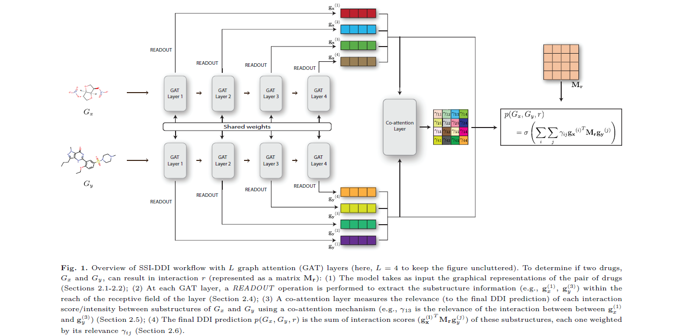

# SSI-DDI
Source code for ["SSI–DDI: substructure–substructure interactions for drug–drug interaction prediction"]( https://doi.org/10.1093/bib/bbab133) 
   
  

 ## Implementation setup
The versions are optional, we expect the code to work with latest versions as well.
* Python == 3.7
* [PyTorch](https://pytorch.org/) == 1.6
* [PyTorch Geometry](https://pytorch-geometric.readthedocs.io/) == 1.6
* [rdkit](https://www.rdkit.org/) == 2020.09.2

## Usage
    python train_script.py <parameters>